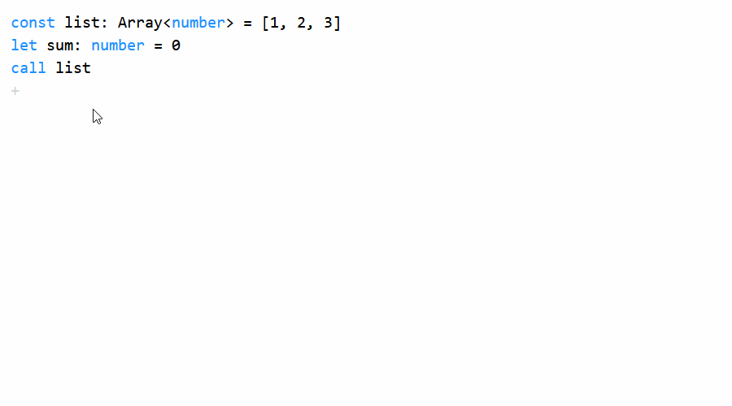
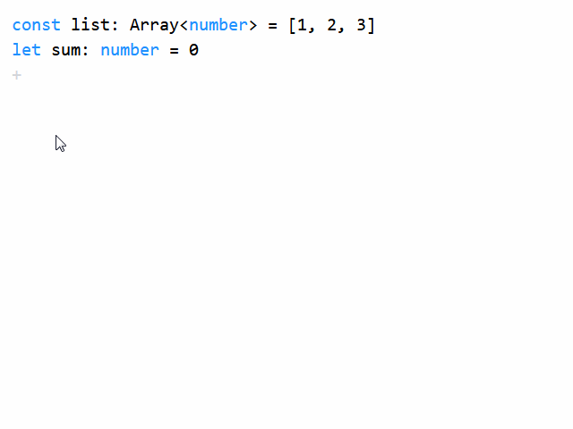

# Code Builder

Visual programming with TypeScript

Once I wondered how cool it would be if I could do visual programming in modern language.\
And after years of coding in TypeScript, I become more attached to it.\
So I give it a try.


## Screenshot

### forEach



### for of




## Setup

```bash
# install dependencies
npm install

# run the app
npm start
```

Open [http://localhost:3000](http://localhost:3000) to view it in the browser.
